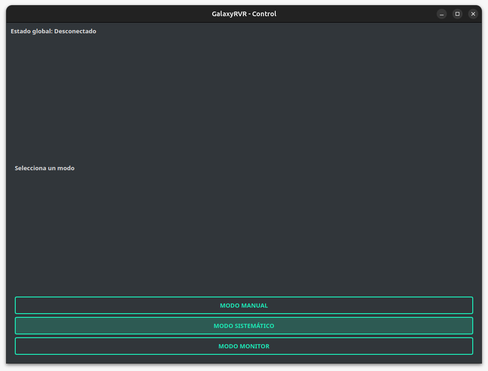
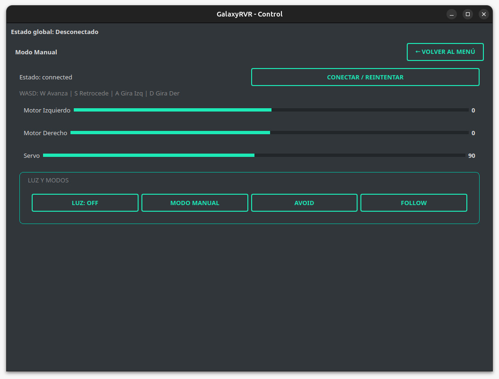
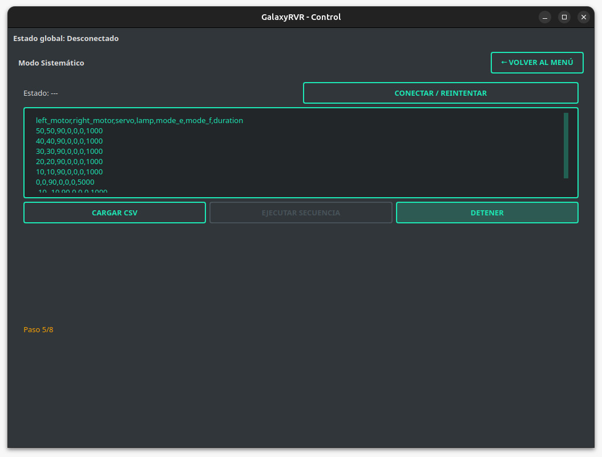
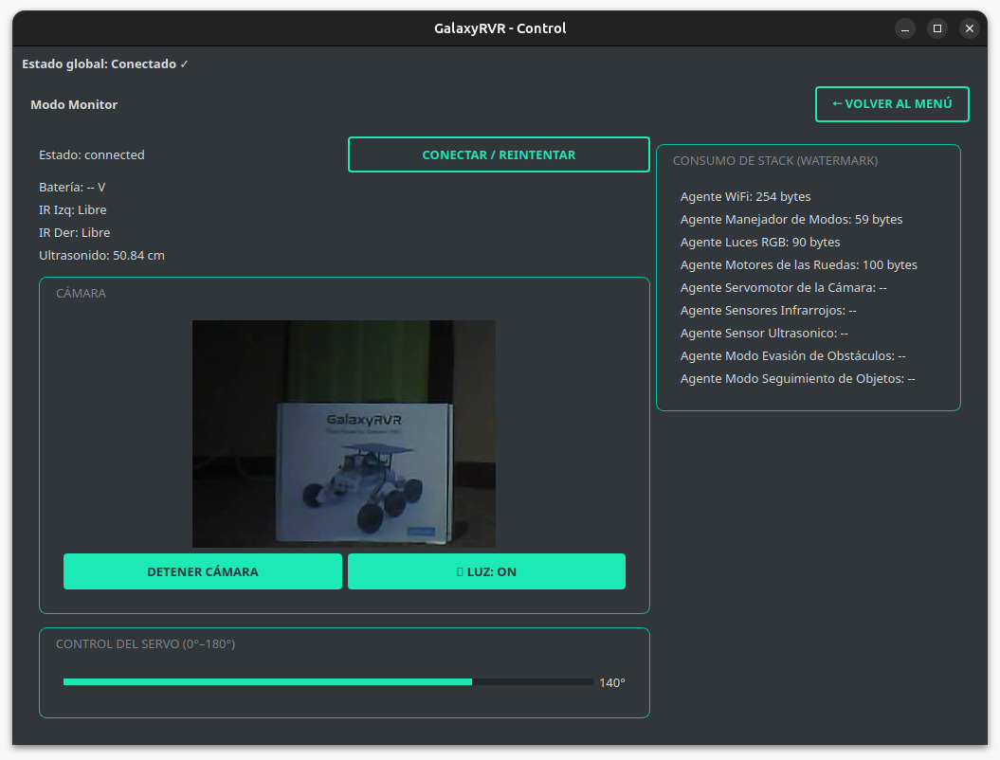

# 🚀 GalaxyRVR-Control-App

A desktop application developed in **Python** using **PyQt5**, **qasync**, and **OpenCV** for controlling and monitoring the **GalaxyRVR rover**.  
It provides real-time communication with the rover’s onboard multi-agent system (FreeMAES + FreeRTOS) over **WebSockets**, allowing the user to operate, automate, and observe the rover’s behavior.

---

## 🛰️ Overview

The **GalaxyRVR Control App** serves as a unified control interface for the GalaxyRVR rover, supporting three main operating modes:

- **Manual Mode:** Direct, real-time control of motors, servo, and lights using sliders or keyboard (WASD).
- **Systematic Mode:** Automated sequence execution using CSV-based command files.
- **Monitor Mode:** Real-time telemetry visualization (battery, sensors, agent stack usage) and live camera feed.

This project was developed as part of the **Embedded Multi-Agent System validation framework** for rover navigation at the **SETEC Lab**,  
**Instituto Tecnológico de Costa Rica (TEC).**

---

## ⚙️ Requirements

### 🐍 1. Create and Activate a Python Virtual Environment

```bash
python -m venv venv
source venv/bin/activate
```

### 📦 2. Install Dependencies from requirements.txt

All dependencies are listed in the provided **requirements.txt** file.  
Simply run the following command inside the project directory:

```bash
pip install -r requirements.txt
```

> **Note:**  
> On Linux systems using **Wayland**, the app automatically switches to `xcb` to avoid display issues.  
> Make sure you have `x11` and `xcb` related dependencies installed (e.g., `sudo apt install libxcb-xinerama0`).

---

## 🕹️ How to Use

1. Clone the repository:

```bash
git clone https://github.com/yourusername/GalaxyRVR-Control-App.git
cd GalaxyRVR-Control-App
```

2. Activate your Python environment and run the application:

```bash
python GalaxyRVR-Control-App.py
```

3. Connect your PC to the rover’s Wi-Fi network (default IP: **192.168.4.1**).

4. Use the **“Connect / Retry”** button inside any mode to establish communication via WebSocket (default port **8765**).

---

## 🧭 Application Windows

Below is an overview of each window included in the application.

### 🧩 Main Menu

Displays three options to navigate between modes:
- **Manual Mode**
- **Systematic Mode**
- **Monitor Mode**

_Add image here:_
```markdown

```

---

### 🎮 Manual Mode

This mode allows **direct control** of the rover using:
- **Sliders** for each motor and the camera servo.
- **WASD keyboard keys** for intuitive directional control.
- **Buttons** to toggle the **RGB lamp** and activate **Avoid** or **Follow** behavior modes.

_Add image here:_
```markdown

```

**Features:**
- Realtime sending every 100 ms (`SEND_PERIOD_MS`).
- Differential drive mixing using key combinations (e.g., `W+A`, `W+D`).
- Auto-stop on window change.

---

### ⚙️ Systematic Mode

Enables **automated command execution** by loading CSV files with motion sequences.

CSV format example:
```
K,Q,D,M,E,F,duration_ms
50,50,90,0,0,0,2000
0,50,90,1,0,0,1000
-50,50,90,0,1,0,1500
0,0,45,0,0,1,2000
```

**Functions:**
- Load plan (`.csv`)  
- Execute or stop sequence  
- Visual progress display (`Step X/Y`)  
- Auto-stop and reset on exit  

_Add image here:_
```markdown

```

---

### 📡 Monitor Mode

Provides **telemetry visualization** and **live video streaming**.

Includes:
- **Battery voltage**
- **Infrared sensors (left/right)**
- **Ultrasonic distance**
- **Camera stream (MJPEG)**
- **Servo angle control**
- **Lamp toggle**
- **Stack watermark table** for all 9 agents in the rover system:
  - A1 → WiFi Agent  
  - A2 → Mode Manager Agent  
  - A3 → RGB Lights Agent  
  - A4 → Wheel Motor Agent  
  - A5 → Camera Servo Agent  
  - A6 → Infrared Sensors Agent  
  - A7 → Ultrasonic Sensor Agent  
  - A8 → Obstacle Avoidance Agent  
  - A9 → Object Following Agent  

_Add image here:_
```markdown

```

---

## 💡 Recommendations

- Ensure the rover’s Wi-Fi network is stable before connecting.
- Close other applications using the same camera or network port.
- If the camera feed appears inverted, adjust the `cv2.rotate` configuration in `VideoThread`.
- Keep CSV commands within safe motor and servo ranges.
- Always stop the rover before switching modes.

---

## 👤 Author

**Óscar Fernández Zúñiga**  
Final-year Electronic Engineering Student  
**Instituto Tecnológico de Costa Rica (TEC)**  
📍 SETEC Laboratory – Embedded Systems and Space Technologies  
📧 [YourEmailHere]

---

## 🧾 License

This project is released under the **MIT License**.  
Feel free to use, modify, and share it for educational or research purposes.

---
